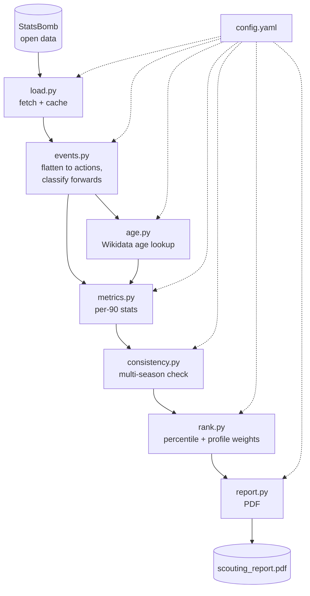

# Soccer Scouting Pipeline

Finds the strongest young forwards (18-23) in StatsBomb's open data, checks
them for consistency across three La Liga seasons (2015/16-2017/18), and
ranks them against three role profiles. Output is a 3-page PDF scouting
report, top 10 players per profile.

This is a method demonstration. The StatsBomb loader (`src/load.py`) is the
only module that knows where the event data comes from, so swapping in an
NCAA D1 feed later means replacing `load.py` (and maybe `age.py`'s source)
without touching `events.py`, `metrics.py`, `rank.py`, or `report.py`.

## Architecture



`main.py` runs `load` through `metrics` once per configured season, then
hands all seasons to `consistency.py` before ranking and rendering.

## Why La Liga 2015/16, and why Wikidata instead of FBref

Checked three full 380-match seasons (Premier League, La Liga, Serie A, all
2015/16), the only StatsBomb open-data seasons that are complete rather than
single-team subsets. All three had a similar forward pool size; La Liga
2015/16 was picked.

FBref, the age source named in the original brief, sits behind a Cloudflare
challenge that blocks plain requests. Rather than add a headless browser to
get past a CAPTCHA, `age.py` pulls birthdates from Wikidata instead: same
join-by-name approach, same reconciliation problem (StatsBomb records full
legal names like "Luis Alberto Suárez Díaz" that don't match a Wikidata
page's common name), but a source that's actually reachable.

Understat was checked too, as a fallback: it's reachable, but loads its
stats client-side, so a plain fetch returns an empty shell. Its data is also
match-result-level only (no shot locations, no pressures), so it couldn't
have fed this pipeline's location-based metrics even if it were reachable.

## Setup

```bash
python3.11 -m venv .venv
source .venv/bin/activate
pip install -r requirements.txt
```

## Run

```bash
python main.py
```

First run fetches and caches each season from StatsBomb (the full 2015/16
season takes a few minutes; the two partial seasons are quick) and resolves
every forward's age against Wikidata once. Everything is cached to `data/`,
so later runs are fast. Output: `output/scouting_report.pdf`.

Quick smoke test on a handful of matches per season:

```bash
python main.py --max-matches 8
```

## Known gotchas this pipeline handles explicitly

1. **Position is per-appearance, not per-player.** A player counts as a
   forward if a forward position was their starting position in most of
   their appearances *in that season*, not from a single lineup tag. See
   `events.classify_forwards`.
2. **xG is StatsBomb's own `shot_statsbomb_xg`.** No xG model is built here.
3. **Age isn't in StatsBomb data, and FBref can't be scraped.** `age.py`
   searches Wikidata by name, checks the result is actually a footballer,
   and logs anything it can't confidently resolve to
   `data/unmatched_players.csv` instead of dropping it. Add a row to
   `data/manual_age_overrides.csv` to fix one; it's checked first and always
   wins.
4. **Small samples skew rate stats.** `playing_time.min_minutes` (600 by
   default) keeps thin samples out of each season's pool, and every metric
   is a percentile within the pool rather than a raw number, since shot and
   pass volume is skewed by a handful of heavy-usage players. The composite
   score doesn't discount for sample size though, so a player let in through
   the scaled floor (below) can still rank #1 off a handful of matches;
   `report.py` flags anyone under 300 total minutes directly on their row.
5. **Only one of the three tracked seasons is complete.** 2016/17 and
   2017/18 are Barcelona-only releases (every Barcelona match, plus each
   opponent's two games against them), so a flat 600-minute floor would make
   those seasons unusable outside Barcelona. `main.py` scales the floor per
   player by how much of their team's season is actually in the dataset
   (`events.count_team_matches`), down to an absolute floor of 90 minutes
   (`playing_time.min_minutes_absolute_floor`) so a single cameo still can't
   qualify. That took the qualifying pool from 1 Barcelona player to 38
   across many clubs, though it doesn't fully close the gap; see Limitations.

## Configuration

Everything tunable lives in `config.yaml`: which seasons to track, the
consistency threshold, age band, minutes floor, forward-position list,
metric definitions, profile weights, and shortlist size. Profile weights
should sum to ~1.0 so the composite score reads as a weighted-average
percentile.

## Data directory

```
data/
  raw/                       cached StatsBomb pulls, gitignored
  age_lookup.csv             cached Wikidata name -> birthdate resolutions, gitignored
  unmatched_players.csv      names Wikidata couldn't resolve, gitignored, regenerated each run
  manual_age_overrides.csv   optional user-maintained corrections (statsbomb_name, birth_date)
```

## Limitations

Season coverage is uneven (see gotcha 5): non-Barcelona players in 2016/17
and 2017/18 are working from a much smaller sample than a full campaign,
which is why the report flags anyone under 300 total minutes. Output
reflects team and league strength as much as individual skill. These
percentiles are relative to this qualifying pool and won't carry over to an
NCAA pool without re-baselining once the loader is swapped. Age matching is
by name, not a shared player ID, so a same-name mix-up is possible;
unmatched names are logged rather than dropped, but a wrong match wouldn't
be caught the same way.

To change the season-coverage tradeoff: raise `consistency.min_seasons_qualified`
for a stricter track-record requirement, raise
`playing_time.min_minutes_absolute_floor` to demand more minutes from thin
seasons, or drop 2016/17 and 2017/18 from `seasons` for a single-season
report.
